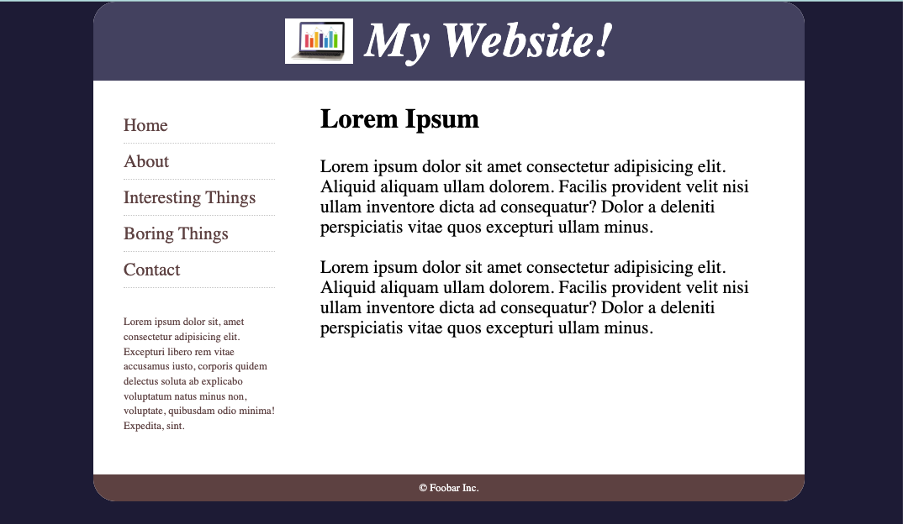

# HTML Assignment 1

This project is a mock webpage built using HTML and CSS as part of my apprenticeship.

## 📌 Overview

The goal of this assignment was to recreate a provided webpage layout using:

- Semantic HTML structure
- CSS for layout and styling
- Flexbox for positioning elements

## 🧱 Features

- Header with image and styled title
- Sidebar navigation with divider lines
- Main content area with text
- Footer section
- Centered layout with a card-style design
- Custom color scheme based on mockup

## 🛠️ Technologies Used

- HTML5
- CSS3
- Flexbox

## 📁 Project Structure

project-folder/
│
├── index.html
├── styles.css
└── images/

## 🚀 What I Learned

- How to structure a webpage using semantic HTML
- How to use Flexbox to control layout
- How to debug CSS and file path issues
- How spacing (margin, padding, gap) affects layout
- How to recreate a design from a visual reference

## 📸 Preview

(Add a screenshot here later if you'd like)

## 📬 Notes

This is an early project as I continue building my skills in front-end development.

## 📸 Preview

